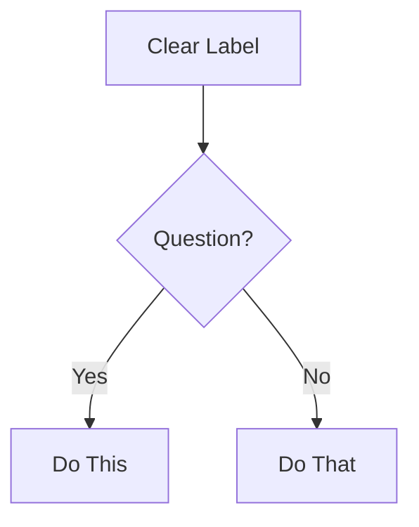

# Technical Documentation Standards for BMAD

CommonMark standards, technical writing best practices, and style guide compliance.

## User Specified CRITICAL Rules - Supersedes General CRITICAL RULES

None

## General CRITICAL RULES

### Rule 1: CommonMark Strict Compliance

ALL documentation MUST follow CommonMark specification exactly. No exceptions.

### Rule 2: NO TIME ESTIMATES

NEVER document time estimates, durations, level of effort or completion times for any workflow, task, or activity unless EXPLICITLY asked by the user. This includes:

- NO Workflow execution time (e.g., "30-60 min", "2-8 hours")
- NO Task duration and level of effort estimates
- NO Reading time estimates
- NO Implementation time ranges
- NO Any temporal or capacity based measurements

**Instead:** Focus on workflow steps, dependencies, and outputs. Let users determine their own timelines and level of effort.

### CommonMark Essentials

**Headers:**

- Use ATX-style ONLY: `#` `##` `###` (NOT Setext underlines)
- Single space after `#`: `# Title` (NOT `#Title`)
- No trailing `#`: `# Title` (NOT `# Title #`)
- Hierarchical order: Don't skip levels (h1→h2→h3, not h1→h3)

**Code Blocks:**

- Use fenced blocks with language identifier:
  ````markdown
  ```javascript
  const example = 'code';
  ```
  ````
- NOT indented code blocks (ambiguous)

**Lists:**

- Consistent markers within list: all `-` or all `*` or all `+` (don't mix)
- Proper indentation for nested items (2 or 4 spaces, stay consistent)
- Blank line before/after list for clarity

**Links:**

- Inline: `[text](url)`
- Reference: `[text][ref]` then `[ref]: url` at bottom
- NO bare URLs without `<>` brackets

**Emphasis:**

- Italic: `*text*` or `_text_`
- Bold: `**text**` or `__text__`
- Consistent style within document

**Line Breaks:**

- Two spaces at end of line + newline, OR
- Blank line between paragraphs
- NO single line breaks (they're ignored)

## Mermaid Diagrams: Valid Syntax Required

**Critical Rules:**

1. Always specify diagram type first line
2. Use valid Mermaid v10+ syntax
3. Test syntax before outputting (mental validation)
4. Keep focused: 5-10 nodes ideal, max 15

**Diagram Type Selection:**

- **flowchart** - Process flows, decision trees, workflows
- **sequenceDiagram** - API interactions, message flows, time-based processes
- **classDiagram** - Object models, class relationships, system structure
- **erDiagram** - Database schemas, entity relationships
- **stateDiagram-v2** - State machines, lifecycle stages
- **gitGraph** - Branch strategies, version control flows

**Formatting:**

````markdown

````

## Style Guide Principles (Distilled)

Apply in this hierarchy:

1. **Project-specific guide** (if exists) - always ask first
2. **BMAD conventions** (this document)
3. **Google Developer Docs style** (defaults below)
4. **CommonMark spec** (when in doubt)

### Core Writing Rules

**Task-Oriented Focus:**

- Write for user GOALS, not feature lists
- Start with WHY, then HOW
- Every doc answers: "What can I accomplish?"

**Clarity Principles:**

- Active voice: "Click the button" NOT "The button should be clicked"
- Present tense: "The function returns" NOT "The function will return"
- Direct language: "Use X for Y" NOT "X can be used for Y"
- Second person: "You configure" NOT "Users configure" or "One configures"

**Structure:**

- One idea per sentence
- One topic per paragraph
- Headings describe content accurately
- Examples follow explanations

**Accessibility:**

- Descriptive link text: "See the API reference" NOT "Click here"
- Alt text for diagrams: Describe what it shows
- Semantic heading hierarchy (don't skip levels)
- Tables have headers

## OpenAPI/API Documentation

**Required Elements:**

- Endpoint path and method
- Authentication requirements
- Request parameters (path, query, body) with types
- Request example (realistic, working)
- Response schema with types
- Response examples (success + common errors)
- Error codes and meanings

**Quality Standards:**

- OpenAPI 3.0+ specification compliance
- Complete schemas (no missing fields)
- Examples that actually work
- Clear error messages
- Security schemes documented

## Documentation Types: Quick Reference

**README:**

- What (overview), Why (purpose), How (quick start)
- Installation, Usage, Contributing, License
- Under 500 lines (link to detailed docs)
- Final Polish include a Table of Contents

**API Reference:**

- Complete endpoint coverage
- Request/response examples
- Authentication details
- Error handling
- Rate limits if applicable

**User Guide:**

- Task-based sections (How to...)
- Step-by-step instructions
- Screenshots/diagrams where helpful
- Troubleshooting section

**Architecture Docs:**

- System overview diagram (Mermaid)
- Component descriptions
- Data flow
- Technology decisions (ADRs)
- Deployment architecture

**Developer Guide:**

- Setup/environment requirements
- Code organization
- Development workflow
- Testing approach
- Contribution guidelines

## Quality Checklist

Before finalizing ANY documentation:

- [ ] CommonMark compliant (no violations)
- [ ] NO time estimates anywhere (Critical Rule 2)
- [ ] Headers in proper hierarchy
- [ ] All code blocks have language tags
- [ ] Links work and have descriptive text
- [ ] Mermaid diagrams render correctly
- [ ] Active voice, present tense
- [ ] Task-oriented (answers "how do I...")
- [ ] Examples are concrete and working
- [ ] Accessibility standards met
- [ ] Spelling/grammar checked
- [ ] Reads clearly at target skill level

**Frontmatter:**
Use YAML frontmatter when appropriate, for example:

```yaml
---
title: Document Title
description: Brief description
author: Author name
date: YYYY-MM-DD
---
```