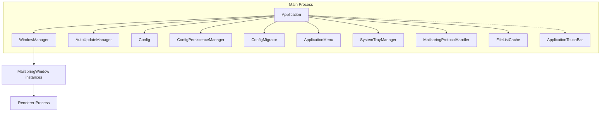
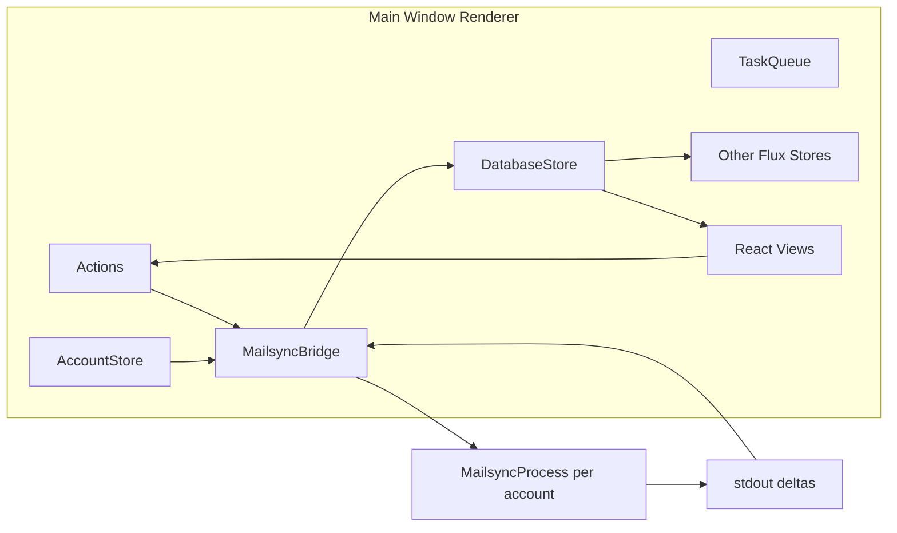

# Electron Application – Component View

This document describes the main components of the Electron application: the **main process** (Application class and collaborators) and the **renderer** (main window) where the MailsyncBridge and Flux stores run. See [containers.md](containers.md) for the container-level view.

## Main Process (Application Class)

The main process is driven by `Application` in `app/src/browser/application.ts`. It owns lifecycle, config, and window management; it does **not** run the MailsyncBridge (that runs in the main window's renderer).

### Main Process Component Responsibilities

| Component | Responsibility |
|-----------|----------------|
| **Application** | Singleton; starts app, owns config dir and resource path, creates and wires subcomponents, handles app events (quit, open URL, etc.). Runs MailsyncProcess.migrate() at startup. |
| **WindowManager** | Creates and manages BrowserWindow instances (main, onboarding, calendar, contacts, spec). Ensures correct window type per token state; sends IPC to windows. |
| **AutoUpdateManager** | Checks for updates; notifies windows when an update is available. |
| **Config** | Loads/saves user config (e.g. `config.json`). |
| **ConfigPersistenceManager** | Handles persistence of config to disk. |
| **ConfigMigrator** | Migrates config schema when the app is upgraded. |
| **ApplicationMenu** | Builds the native menu (File, Edit, View, etc.). |
| **SystemTrayManager** | System tray icon and menu (where supported). |
| **MailspringProtocolHandler** | Handles `mailspring:` protocol URLs. |
| **FileListCache** | Caches file lists for performance. |
| **ApplicationTouchBar** | macOS Touch Bar (darwin only). |

### MailsyncProcess in Main Process

The main process uses `MailsyncProcess` only for **migration** at startup (`mailsync.migrate()`). The actual sync processes are **spawned from the renderer** (main window) by `MailsyncBridge`, which has access to the same binary path and config dir. See [../data-flow.md](../data-flow.md).

---

## Main Window Renderer (Flux and Sync Bridge)

The **main window** renderer loads the Flux layer, including MailsyncBridge. Only the main window runs MailsyncBridge; other windows (e.g. onboarding, calendar) receive database updates via IPC rebroadcast.

### Responsibilities

| Component | Responsibility |
|-----------|----------------|
| **Actions** | Central action dispatcher (`flux/actions.ts`). UI and stores call e.g. `Actions.queueTask(task)`. |
| **MailsyncBridge** | Listens to `Actions.queueTask`, `Actions.queueTasks`, `Actions.cancelTask`, `Actions.fetchBodies`. Maintains one `MailsyncProcess` per account; sends JSON to stdin, parses stdout into `DatabaseChangeRecord`, calls `DatabaseStore.trigger(record)`. Rebroadcasts deltas to other windows via IPC so they can trigger their DatabaseStore too. |
| **DatabaseStore** | Holds the SQLite connection (read-only); triggers on incoming change records; provides `findAll`, `findBy`, etc. for reactive queries. |
| **AccountStore** | List of accounts; MailsyncBridge uses it to ensure a sync process exists per account. |
| **TaskQueue** | Observes Task model changes; exposes `queue()`, `completed()`, `waitForPerformLocal`, `waitForPerformRemote`. |
| **Other Flux Stores** | DraftStore, FolderSyncProgressStore, IdentityStore, etc. Subscribe to DatabaseStore or Actions as needed. |
| **React Views** | Internal packages (thread-list, composer, preferences, etc.) that subscribe to stores and dispatch actions. |

---

## Relationship to Containers

- **Main Process** = Application + WindowManager + … (one process).
- **Renderer Process** = One per window; the main window’s renderer hosts MailsyncBridge and the Flux stores that drive the UI.
- **Mailsync Engine** = Separate C++ process(es), one per account; see [components-mailsync.md](components-mailsync.md).

For data flow from user action to UI update, see [../data-flow.md](../data-flow.md). For store-to-store dependencies, see [../module-dependencies.md](../module-dependencies.md).
