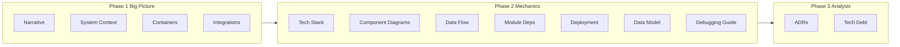

# Mailspring Documentation Roadmap (BMAD)

This plan structures the brownfield documentation work into **three sequential phases** using the BMAD framework. Execute phases in order; each phase produces artifacts that the next phase can reference. All tasks use checkboxes so the roadmap can be tracked incrementally.

**Relevant codebase facts (from research):**

- **C++ backend**: Lives in the **git submodule** `mailsync` ([Mailspring-Sync](https://github.com/Foundry376/Mailspring-Sync)); `binding.gyp` and C++ build config live there, not in the root repo.
- **IPC / data flow**: Electron main window runs [app/src/flux/mailsync-bridge.ts](app/src/flux/mailsync-bridge.ts); it spawns [app/src/mailsync-process.ts](app/src/mailsync-process.ts) per account. Sync engine talks via **stdin (JSON commands)** and **stdout (newline-delimited JSON deltas)**. Deltas become [DatabaseChangeRecord](app/src/flux/stores/database-change-record.ts) and are applied via `DatabaseStore.trigger(record)`; other windows receive the same deltas via IPC `mailsync-bridge-message`.
- **Packaging**: Uses **@electron/packager** (not electron-builder), driven by [app/build/Gruntfile.js](app/build/Gruntfile.js) and [app/build/tasks/package-task.js](app/build/tasks/package-task.js). CI: [.github/workflows/build-macos.yaml](.github/workflows/build-macos.yaml), [build-linux.yaml](.github/workflows/build-linux.yaml), [build-windows.yaml](.github/workflows/build-windows.yaml); signing/notarization and installers (e.g. [create-signed-windows-installer.js](app/build/create-signed-windows-installer.js), [create-mac-zip.js](app/build/tasks/create-mac-zip.js)) are part of the build pipeline.
- **Existing docs**: [CLAUDE.md](CLAUDE.md) already summarizes sync engine communication and task lifecycle; [docs/](docs/) holds feature-specific plans (e.g. undo-redo, calendar). No ADR folder yet—recommend `docs/adr/` or `docs/architecture/`.
- **Technical debt scan**: ~33 TODO/FIXME matches in `app/src` across 26 files; plan Phase 3 to scan `app/` (and optionally `mailsync` submodule if available) and catalog with priority/effort.

---

## Phase 1: Big Picture (The Map)

Establish the "map" of the system: why the architecture exists, where boundaries are, and what the system talks to.

- **Current State Architecture Narrative**  
  Write a high-level summary of the **Dual-Core** design: separation between the Electron frontend and the C++ Mailsync backend, their responsibilities (UI vs. sync/protocols/persistence), and why this split was chosen (performance, isolation, reuse of C++ mail libraries, etc.). Can extend or refactor the "Core Data Flow" and "Sync Engine Communication" sections in [CLAUDE.md](CLAUDE.md) into a standalone narrative (e.g. `docs/architecture/current-state.md`).
- **System Context Diagram**  
  Produce a **system context diagram** (C4 Level 1): system boundary of "Mailspring," the **User**, and **Email Providers** (and any other external systems). Tool-agnostic (draw.io, Mermaid, Excalidraw, etc.); store in `docs/architecture/` or `_bmad/` and reference from the narrative.
- **Container Diagram**  
  Create a **Mermaid C4 container diagram** with the four primary containers: **Renderer Process**, **Main Process**, **Mailsync Engine (C++)**, and **SQLite Database**, plus their interactions (IPC, stdin/stdout, DB file access). Clarify that SQLite is written only by the C++ process and read by the Electron app (WAL, readonly connection in [app/src/flux/stores/database-store.ts](app/src/flux/stores/database-store.ts)).
- **Integration Points Documentation**  
  Compile a list of **external protocols and APIs**: IMAP, SMTP, CalDAV, CardDAV; Gmail OAuth (e.g. [internal_packages/onboarding/lib/onboarding-constants](app/internal_packages/onboarding/lib/onboarding-constants)); other OAuth or provider-specific APIs. For each: auth mechanism, data exchange pattern, and where in the codebase they are used (frontend vs. C++). Error strings in [app/src/mailsync-process.ts](app/src/mailsync-process.ts) (e.g. Gmail, Yahoo, Outlook) are a useful inventory of provider quirks.

---

## Phase 2: Mid-Level (The Mechanics)

Document how the system is built, how data moves, and how it is deployed.

- **Technology Stack Inventory**  
  Scan and document:
  - **Root**: [package.json](package.json) (Node ≥16.17, Electron 39.x, TypeScript, React, better-sqlite3, Reflux, etc.).
  - **Mailsync submodule**: `mailsync/`—`binding.gyp`, CMake/build files, C++ standard, and key libraries (if the submodule is present).
  - **Build/config**: [app/build/Gruntfile.js](app/build/Gruntfile.js), [app/package.json](app/package.json) if different, and any other version constraints. Output a single **technology stack** doc (e.g. `docs/architecture/technology-stack.md`) with versions and constraints.
- **Component/Container Diagrams**  
  Create **component-level diagrams** for:
  - **Mailsync engine** (C++): main components (sync, IMAP/SMTP clients, DB writer, delta emission). Detail may be limited if only the Electron repo is available; document what is inferred from process interface (stdin/stdout message types) and any docs in the submodule.
  - **Electron application**: [app/src/browser/application.ts](app/src/browser/application.ts) and its main collaborators (window manager, MailsyncBridge, stores). Show subcomponents and responsibilities.
- **Data Flow Diagrams**  
  Trace and document the **critical path**:  
  **Internet → C++ (Mailsync) → SQLite → IPC / stdout → Flux (MailsyncBridge → DatabaseStore.trigger) → React View**.  
  Key files: [mailsync-process.ts](app/src/mailsync-process.ts) (spawn, stdout), [mailsync-bridge.ts](app/src/flux/mailsync-bridge.ts) (`deltas` → `DatabaseChangeRecord` → `DatabaseStore.trigger`), [database-change-record.ts](app/src/flux/stores/database-change-record.ts), [database-store.ts](app/src/flux/stores/database-store.ts). Identify transformation points (JSON parsing, model hydration) and document potential bottlenecks (single DB connection, per-account sync process, IPC rebroadcast).
- **Module Dependency Maps**  
  Visualize relationships between **key Flux stores** (e.g. AccountStore, DatabaseStore, TaskQueue, DraftStore) and other core modules (Actions, Models, MailsyncBridge). Focus on data dependencies and state flow (who listens to whom, who triggers whom). Can be a diagram plus a short table in `docs/architecture/module-dependencies.md`.
- **Deployment Architecture**  
  Document how the **binary is built, signed, and distributed**:
  - **Packaging**: @electron/packager via [app/build/tasks/package-task.js](app/build/tasks/package-task.js) (options in Grunt config), post-packaging steps (symlinks, transpilation, commit hash).
  - **Platforms**: macOS (zip + notarization), Windows (electron-winstaller / [create-signed-windows-installer.js](app/build/create-signed-windows-installer.js)), Linux (deb/rpm from [installer-linux-task.js](app/build/tasks/installer-linux-task.js), [snap/snapcraft.yaml](snap/snapcraft.yaml) if used).
  - **CI**: [.github/workflows/build-macos.yaml](.github/workflows/build-macos.yaml), [build-linux.yaml](.github/workflows/build-linux.yaml), [build-windows.yaml](.github/workflows/build-windows.yaml)—secrets (e.g. signing, S3), artifact naming, and distribution. Optionally mention [.circleci/config.yml](.circleci/config.yml) if still in use.
- **Data Model Documentation**  
  Create **docs/architecture/data-model.md** with a Mermaid ER diagram derived from Flux models. Document the SQLite schema used by the app (e.g. `edgehill.db`) and core tables (e.g. Thread, Message, Account, Task, Contact, Event) and key relationships, inferred from `app/src/flux/models/` and the C++ sync engine if available.
- **Debugging Guide**  
  Create **docs/guides/debugging-dual-core.md** explaining how to attach debuggers to the C++ bridge. Cover: attaching to the Mailsync process; inspecting stdin/stdout between [app/src/flux/mailsync-bridge.ts](app/src/flux/mailsync-bridge.ts) and the C++ process; verbose logging (e.g. `core.sync.verboseUntil`); tailing mailsync logs (`mailsync-<accountId>.log`); CrashTracker behavior; and running/debugging the sync process in isolation. Link to [data-flow.md](docs/architecture/data-flow.md) and [mailsync-bridge.ts](app/src/flux/mailsync-bridge.ts).

The data model and debugging guide are high-priority deliverables for onboarding and debugging the dual-core architecture.

---

## Phase 3: Analysis & Logic (ADRs and Debt)

Capture decisions and known debt so future work is informed.

- **Architecture Decision Records**  
  Draft **retrospective ADRs** (e.g. in `docs/adr/`):
  - **ADR-001 Split-Engine Architecture**: Rationale for Electron (UI) + C++ (sync/protocols/persistence); tradeoffs (complexity, IPC, debugging) and alternatives considered.
  - **ADR-002 Local-First Strategy**: Data persistence and sync approach (local SQLite, sync engine as single writer, observable/read-only UI, task queue for mutations). Reference [CLAUDE.md](CLAUDE.md) and the Phase 1/2 data flow docs.
- **Technical Debt Register**  
  Scan the codebase for **TODO**, **FIXME**, **XXX** (and optionally **HACK**) in `app/` (and `mailsync/` if available). Catalog findings in a **technical debt register** (e.g. `docs/technical-debt.md` or a spreadsheet): location, short description, priority (high/medium/low), and rough remediation effort (S/M/L). Optionally flag **legacy patterns**: outdated Node/Electron version constraints, deprecated deps, and migration notes.

---

## Suggested Deliverable Locations

| Artifact                       | Suggested path                                                                        |
| ------------------------------ | -------------------------------------------------------------------------------------- |
| Architecture narrative         | `docs/architecture/current-state.md`                                                   |
| System context / container diagrams | `docs/architecture/diagrams/` (e.g. `system-context.md`, `containers.md`)         |
| Integration points             | `docs/architecture/integration-points.md`                                              |
| Technology stack               | `docs/architecture/technology-stack.md`                                               |
| Data flow & module deps        | `docs/architecture/data-flow.md`, `docs/architecture/module-dependencies.md`          |
| Deployment                     | `docs/architecture/deployment.md`                                                     |
| Data model (SQLite ER)         | `docs/architecture/data-model.md`                                                     |
| Dual-core debugging guide      | `docs/guides/debugging-dual-core.md`                                                   |
| ADRs                           | `docs/adr/0001-split-engine-architecture.md`, `docs/adr/0002-local-first-strategy.md`   |
| Technical debt                 | `docs/technical-debt.md`                                                              |

The existing [CLAUDE.md](CLAUDE.md) and [docs/](docs/) content should be **reused and linked** from these docs to avoid duplication and keep a single source of truth for data flow and task lifecycle.

---

## Execution Order

Complete Phase 1 first (narrative and diagrams feed Phase 2). Within Phase 2, tech stack and data flow are foundational; component diagrams and deployment can be done in parallel. The data model and debugging guide are high-priority Phase 2 deliverables. Phase 3 ADRs and technical debt register can be written once Phase 1–2 artifacts exist for reference.

---

## To-Do List

### Phase 1: Big Picture

- [ ] Current State Architecture Narrative
- [ ] System Context Diagram
- [ ] Container Diagram
- [ ] Integration Points Documentation

### Phase 2: Mechanics

- [ ] Technology Stack Inventory
- [ ] Component/Container Diagrams
- [ ] Data Flow Diagrams
- [ ] Module Dependency Maps
- [ ] Deployment Architecture
- [ ] **Data Model Documentation:** Create `docs/architecture/data-model.md` with a Mermaid ER diagram derived from Flux models.
- [ ] **Debugging Guide:** Create `docs/guides/debugging-dual-core.md` explaining how to attach debuggers to the C++ bridge.

### Phase 3: Analysis and Logic

- [ ] Architecture Decision Records
- [ ] Technical Debt Register
