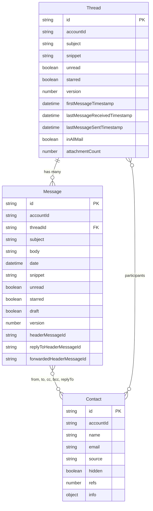

# Data Model (SQLite / Flux)

This document describes the core data entities used by Mailspring and how they relate. The schema is backed by SQLite (e.g. `edgehill.db`). The diagrams and tables below are derived from the Flux models in `app/src/flux/models/` (Thread, Message, Contact).

> **Note:** These models hydrate directly from the SQLite Message and Thread tables managed by the C++ engine.

---

## Entity Relationship Diagram

The following Mermaid ER diagram shows how **Thread**, **Message**, and **Contact** relate. Threads contain many Messages (via `threadId`); Threads and Messages both reference Contacts (participants, from/to/cc/bcc/replyTo).

- **Thread → Message:** One thread has many messages. Each message has a `threadId` pointing to its thread. Messages are immutable (except drafts); move/delete apply at the thread level.
- **Thread → Contact:** A thread has a `participants` collection (Contacts). These contacts do not have persistent IDs; they are derived from the thread's messages.
- **Message → Contact:** A message has `from`, `to`, `cc`, `bcc`, and `replyTo` collections of Contact objects. These represent the message envelope and are stored with the message.

---

## Message: Critical Fields

Critical fields on the Message model (from `app/src/flux/models/message.ts`) that map to SQLite / C++-managed data:

| Field | Type | Description |
| ----- | ----- | ----------- |
| **id** | string | Primary key. |
| **accountId** | string | Account this message belongs to. |
| **threadId** | string | Parent thread ID (foreign key to Thread). |
| **subject** | string | Subject line. |
| **body** | string | HTML or plain-text body (joined from `MessageBody` table; must be explicitly included in queries). |
| **date** | DateTime | When the message was delivered. Queryable. |
| **snippet** | string | Short (~140 character) plain-text summary of the body. |
| **unread** | boolean | Whether the message is unread. Queryable. |
| **starred** | boolean | Whether the message is starred. Queryable. |
| **draft** | boolean | True if the message is a draft. Queryable. |
| **version** | number | Version number (used for drafts; increments on attribute changes). |
| **from** | Contact[] | Sender(s). |
| **to** | Contact[] | To recipients. |
| **cc** | Contact[] | CC recipients. |
| **bcc** | Contact[] | BCC recipients. |
| **replyTo** | Contact[] | Reply-To header contacts. |
| **folder** | Folder | Folder the message lives in (e.g. Inbox). |
| **files** | File[] | Attachments. |
| **headerMessageId** | string | Message-ID header. Queryable. |
| **replyToHeaderMessageId** | string | In-Reply-To / reference to parent message. |
| **forwardedHeaderMessageId** | string | Reference for forwarded messages. |
| **listUnsubscribe** | string | List-Unsubscribe header. |
| **listUnsubscribePost** | string | List-Unsubscribe-Post header. |
| **pristine** | boolean | True if draft has not been edited since creation. |
| **plaintext** | boolean | True if body is plain text, not HTML. |

---

## Related Documentation

- [Current state architecture](current-state.md) – Dual-core design and single-writer SQLite.
- [Data flow](data-flow.md) – How deltas from the C++ engine update the UI.
