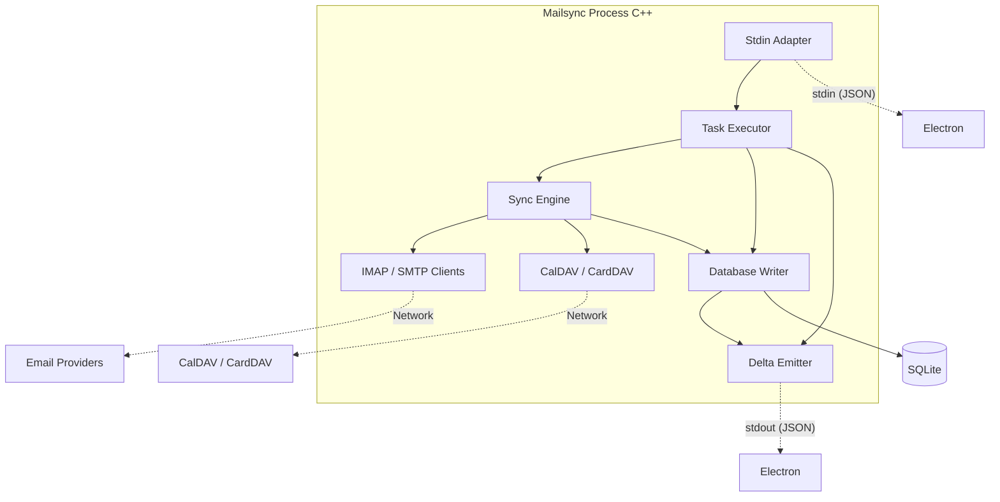

# Mailsync Engine – Component View (Inferred)

The Mailsync engine is implemented in the [Mailspring-Sync](https://github.com/Foundry376/Mailspring-Sync) repository (C++). This document describes its logical components as inferred from the **process interface** used by the Electron app: stdin (JSON commands) and stdout (newline-delimited JSON deltas). When the submodule or Sync repo is available, this can be cross-checked with the actual C++ structure.

## Process Interface (Contract)

- **Input (stdin)**: JSON messages, one per line. Known message types from Electron usage include:
  - Task execution (e.g. send draft, change folder, change labels, sync calendar).
  - Commands: `wake-workers`, `sync-calendar`, `cancel-task`, and account/config-related commands.
- **Output (stdout)**: Newline-delimited JSON lines. Each line is an object with at least:
  - `type`: e.g. `persist` or `unpersist`.
  - `modelClass`: e.g. `Thread`, `Message`, `Task`, `ProcessState`, `ProcessAccountSecretsUpdated`.
  - `modelJSONs`: array of JSON objects representing the changed models.

The Electron app parses these into `DatabaseChangeRecord` and calls `DatabaseStore.trigger(record)` (see [../data-flow.md](../data-flow.md)).

## Inferred Component Diagram

## Component Responsibilities (Inferred)

| Component | Responsibility |
|-----------|----------------|
| **Stdin Adapter** | Reads JSON lines from stdin; dispatches to task executor or command handlers. |
| **Task Executor** | Executes tasks (send draft, change folder, etc.): coordinates sync engine and DB writer; may emit task status deltas. |
| **Sync Engine** | Orchestrates sync with providers: fetch mail (IMAP), send (SMTP), calendar (CalDAV), contacts (CardDAV). Uses IMAP/SMTP and CalDAV/CardDAV clients. |
| **IMAP / SMTP Clients** | Protocol-level communication with email servers (and OAuth where applicable). |
| **CalDAV / CardDAV** | Protocol-level communication with calendar and address book servers. |
| **Database Writer** | Single writer to the local SQLite database (WAL mode). Persists and deletes entities; triggers delta emission for changes. |
| **Delta Emitter** | Serializes database (and process) changes to JSON and writes newline-delimited lines to stdout. |

## Notes

- **One process per account**: The Electron app spawns one Mailsync process per configured account; each process has its own DB view (or the DB is shared with multi-writer discipline—exact details are in the Sync repo).
- **ProcessState / ProcessAccountSecretsUpdated**: Special model classes emitted on stdout for online/offline state and secret updates; the Electron app handles these without persisting to the local DB (see `mailsync-bridge.ts`).
- For authoritative component boundaries and file layout, see the Mailspring-Sync repository and its build/docs.
