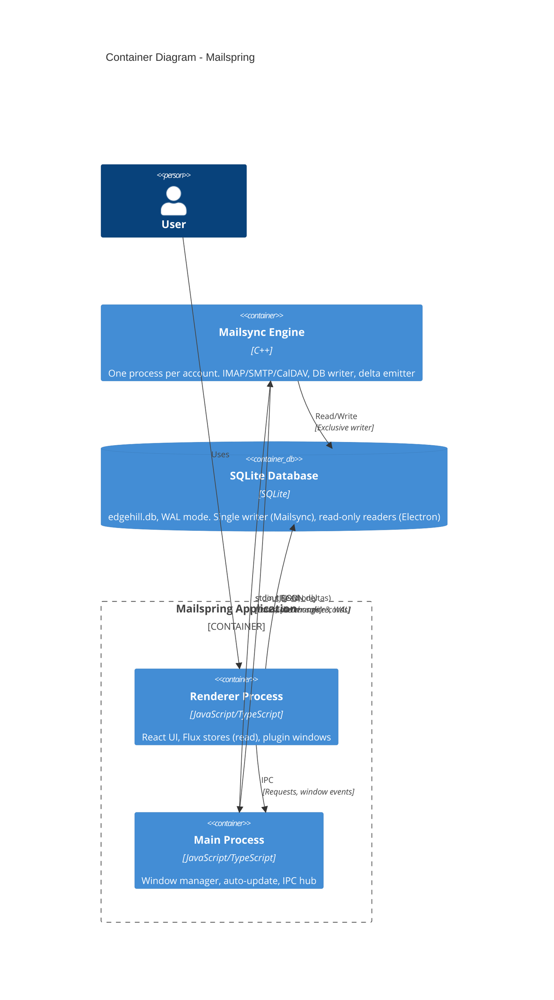

# Container Diagram (C4 Level 2)

This diagram shows the four primary containers inside Mailspring: the Electron renderer, the main process, the C++ Mailsync engine(s), and the SQLite database. It clarifies how data and control flow between them.

## Mermaid Diagram

## Text Description (for non-Mermaid tools)

- **Renderer Process**  
  - Technology: JavaScript/TypeScript (React, Reflux).  
  - Responsibility: All visible UI (thread list, composer, preferences, plugins). Subscribes to Flux stores; dispatches actions (e.g. `Actions.queueTask`). Receives database change notifications via IPC from the main window so that all windows stay in sync.  
  - Does **not** write to the database.

- **Main Process**  
  - Technology: JavaScript/TypeScript (Node/Electron).  
  - Responsibility: Application lifecycle, window manager, auto-updates. In the **main window** only: runs MailsyncBridge, which spawns and manages Mailsync processes, forwards tasks to them via stdin, and receives JSON deltas on stdout. Main process rebroadcasts those deltas to other windows via IPC (`mailsync-bridge-message`) so every window's DatabaseStore can trigger and update the UI.

- **Mailsync Engine (C++)**  
  - Technology: C++ (Mailspring-Sync, one process per account).  
  - Responsibility: Connects to email/calendar/contacts providers (IMAP, SMTP, OAuth, CalDAV, CardDAV); syncs data; executes tasks; writes all changes to SQLite; emits newline-delimited JSON deltas on stdout.  
  - Communication: Receives JSON messages on stdin (task requests, commands). Sends database change records on stdout.

- **SQLite Database**  
  - Technology: SQLite, WAL mode, single file (e.g. `edgehill.db`).  
  - Responsibility: Persistent store for mail, threads, contacts, calendar, tasks, etc.  
  - **Writer**: Only the C++ Mailsync process(es) write to the database.  
  - **Readers**: The Electron app opens the database **read-only** (see `database-store.ts`: `readonly: true`). This allows concurrent reads while the sync engine writes. WAL mode is used for better concurrency.

## Data Flow Summary

- **User action (e.g. "Send", "Move to folder")**  
  Renderer → Actions.queueTask → (IPC to main) → MailsyncBridge → stdin to Mailsync.

- **Sync / task completion**  
  Mailsync writes SQLite and emits deltas on stdout → MailsyncBridge → DatabaseStore.trigger(record) in main window → IPC to other windows → DatabaseStore.trigger in each window → React views re-render via Flux/store subscriptions.

See [../data-flow.md](../data-flow.md) for a step-by-step trace of the critical path.
