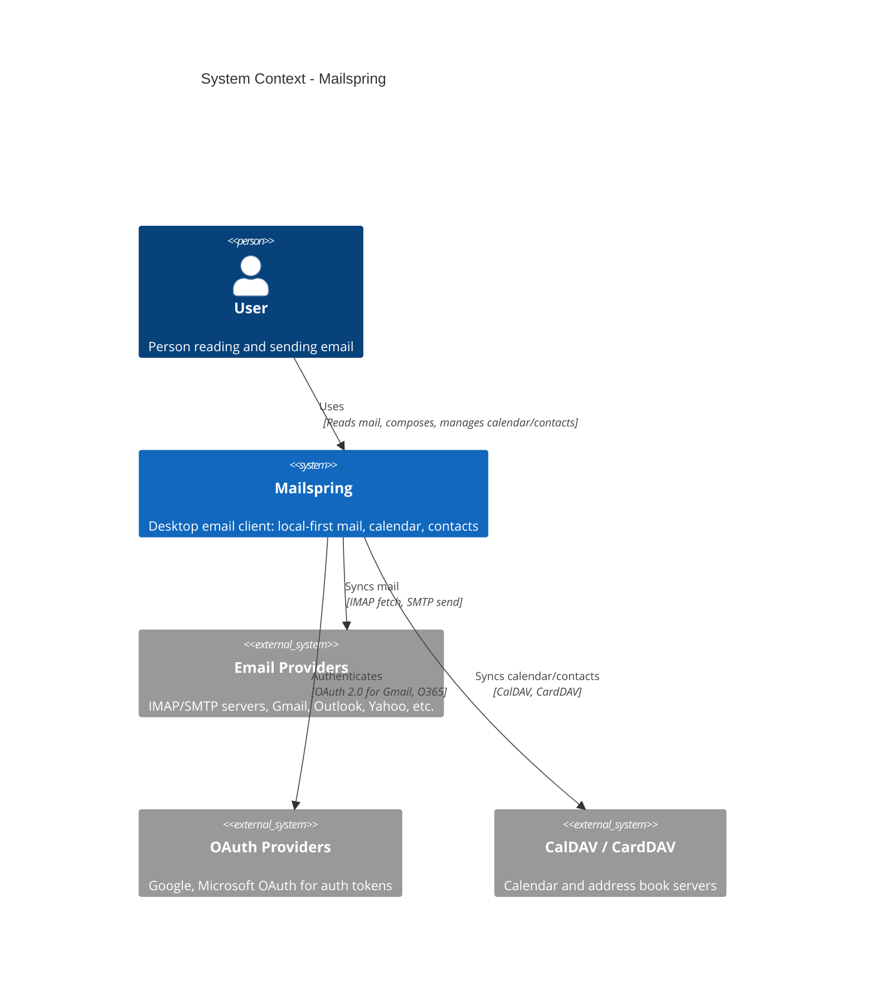

# System Context Diagram (C4 Level 1)

This diagram shows Mailspring as a single system and its relationships with users and external systems. It is the highest-level view of the architecture.

## Mermaid Diagram

## Description

- **User**  
  Interacts with Mailspring to read and send email, manage calendar events, and contacts.

- **Mailspring**  
  The desktop application (Electron + C++ sync engine). It stores data locally (SQLite) and syncs with providers. All external communication is initiated by Mailspring.

- **Email Providers**  
  IMAP/SMTP servers (including Gmail, Outlook, Yahoo, and generic IMAP). Mailspring connects to these for fetching mail and sending messages. Some providers are reached via OAuth instead of or in addition to username/password.

- **OAuth Providers**  
  Google and Microsoft (O365) OAuth. Used to obtain tokens for Gmail and Outlook/Office 365; tokens are then used by the sync engine for IMAP/SMTP or provider-specific APIs.

- **CalDAV / CardDAV**  
  Calendar and address book servers. Mailspring syncs events and contacts with these when configured (e.g. self-hosted or provider CalDAV/CardDAV).

## Usage

This diagram can be rendered in any tool that supports Mermaid (e.g. GitHub, GitLab, VS Code with Mermaid extension). For C4-style rendering, use a Mermaid version or plugin that supports `C4Context`; otherwise treat it as a reference for drawing the same context in draw.io, Excalidraw, or similar.
