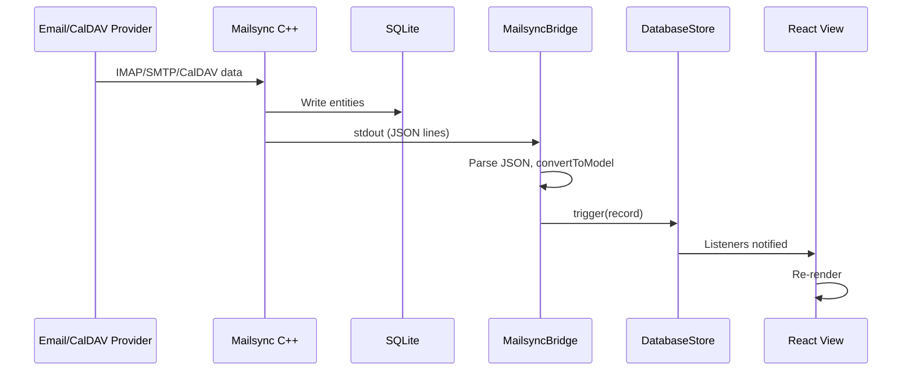
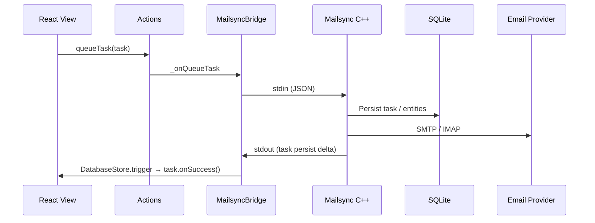

# Data Flow: Critical Path

This document traces the **critical data path** from the internet to the React view, and the reverse path from user action to the sync engine. It identifies transformation points and potential bottlenecks.

## Path 1: Inbound (Provider → UI)

**Internet → C++ (Mailsync) → SQLite → stdout → IPC (optional) → Flux (MailsyncBridge → DatabaseStore.trigger) → React View**

### Step-by-Step

1. **Internet → C++**  
   The Mailsync process (one per account) connects to IMAP/SMTP/CalDAV/CardDAV and receives data. This is entirely inside the C++ sync engine.

2. **C++ → SQLite**  
   The sync engine writes new or updated entities (Thread, Message, Contact, etc.) to the local SQLite database (e.g. `edgehill.db`). It is the **only** writer. The database uses WAL mode for concurrent read/write.

3. **C++ → stdout (deltas)**  
   For each logical change, the sync engine emits a **newline-delimited JSON** line on stdout. Each line is an object with `type` (e.g. `persist`, `unpersist`), `modelClass` (e.g. `Thread`, `Message`), and `modelJSONs` (array of raw JSON for each changed model).

4. **stdout → MailsyncBridge (main window)**  
   `MailsyncProcess` in `app/src/mailsync-process.ts` spawns the C++ process and attaches to its stdout. In `sync()` mode, it buffers stdout and splits on `\n`; each batch of complete lines is emitted as a `deltas` event (see `this.emit('deltas', msgs)`).  
   **File**: `app/src/mailsync-process.ts` (stdout handler around line 298–303).

5. **MailsyncBridge → DatabaseChangeRecord**  
   `MailsyncBridge._onIncomingMessages` (in `app/src/flux/mailsync-bridge.ts`) receives the `deltas` array. For each message it parses JSON, maps `modelJSONs` to Model instances via `Utils.convertToModel`, and creates a `DatabaseChangeRecord({ type, objectClass, objects, objectsRawJSON })`.  
   **Transformation**: Raw JSON → parsed Model instances. Special cases: `ProcessState` and `ProcessAccountSecretsUpdated` are handled without creating a change record for the DB.  
   **File**: `app/src/flux/mailsync-bridge.ts` (lines 389–435).

6. **Rebroadcast to other windows**  
   Before applying the change, the main window sends the raw message to the main process so it can rebroadcast to **other** windows: `ipcRenderer.send('mailsync-bridge-rebroadcast-to-all', msg)`. The main process sends it to all windows except the source (see `application.ts` and window event handler). Other windows receive it via `ipcRenderer.on('mailsync-bridge-message', ...)` and run the same `_onIncomingChangeRecord` path so every window’s DatabaseStore sees the same change.

7. **DatabaseStore.trigger(record)**  
   `MailsyncBridge._onIncomingChangeRecord` calls `DatabaseStore.trigger(record)`. The DatabaseStore does **not** write to SQLite here; it notifies all listeners (stores and components) that the given models changed.  
   **File**: `app/src/flux/mailsync-bridge.ts` (line 441); `app/src/flux/stores/database-store.ts` (trigger implementation).

8. **Stores and React views**  
   Any store or component that has subscribed to `DatabaseStore.listen(...)` receives the change record. They may filter by `objectClass` and refresh their state. React components that depend on those stores re-render.  
   **Pattern**: QuerySubscription, ObservableListDataSource, or direct `DatabaseStore.listen`; see [CLAUDE.md](../../CLAUDE.md) (Observable Database Pattern).

### Diagram (Inbound)

---

## Path 2: Outbound (User Action → Provider)

**User action → React → Actions.queueTask → MailsyncBridge → stdin (JSON) → C++ → SQLite + Provider**

### Step-by-Step

1. **User action**  
   User clicks “Send”, “Move to folder”, “Mark read”, etc. The React component (or store) calls e.g. `Actions.queueTask(new SendDraftTask({ ... }))`.

2. **Actions → MailsyncBridge**  
   `MailsyncBridge` listens to `Actions.queueTask` (and `queueTasks`, `cancelTask`, `fetchBodies`). In `_onQueueTask`, it validates the task, resolves the account, and sends a JSON message to the appropriate account’s Mailsync process via `client.sendMessage(json)`.  
   **File**: `app/src/flux/mailsync-bridge.ts` (`_onQueueTask`, `sendMessageToAccount`).

3. **sendMessage → stdin**  
   `MailsyncProcess.sendMessage` writes the JSON message (plus newline) to the child process’s stdin. The C++ process reads stdin and executes the task (e.g. send draft, change folder).

4. **C++ executes task**  
   The sync engine updates local state (and may write to SQLite) and talks to the provider (e.g. SMTP send, IMAP STORE). When done, it persists task status and emits a delta for the Task model (and any other changed models) on stdout.

5. **Back to inbound path**  
   The task completion flows back as a delta (step 4–8 of the inbound path). When the Task model is persisted with `status === 'complete'`, `MailsyncBridge._onIncomingChangeRecord` runs `task.onSuccess()` or `task.onError(task.error)`.

### Diagram (Outbound)

---

## Transformation Points

| Location | Transformation |
|----------|----------------|
| Mailsync stdout → MailsyncBridge | Newline-split; JSON.parse; filter ProcessState / ProcessAccountSecretsUpdated. |
| modelJSONs → Model instances | `Utils.convertToModel(modelJSON)` in mailsync-bridge.ts. |
| DatabaseChangeRecord → Store listeners | DatabaseStore.trigger(record); listeners receive `{ type, objectClass, objects, objectsRawJSON }`. |
| Other windows | Raw message string sent via IPC; receiving window parses and runs same _onIncomingChangeRecord path (so same Model conversion and trigger). |

---

## Potential Bottlenecks

| Area | Notes |
|------|--------|
| **Single DB connection (read) per window** | Each renderer has one better-sqlite3 connection in readonly WAL mode. Heavy query load in one window could contend. |
| **Per-account sync process** | One C++ process per account; many accounts mean many processes. |
| **stdout parsing** | All deltas are processed on the main thread of the main window; very high delta volume could cause UI jank. |
| **IPC rebroadcast** | Every delta is serialized and sent to every other window; many windows could amplify load. |
| **Task completion callbacks** | onSuccess/onError run synchronously in the trigger path; long-running handlers could delay other listeners. |

---

## Key Files Reference

| Role | File |
|------|------|
| Spawn process, stdout split | `app/src/mailsync-process.ts` |
| Receive deltas, trigger store, rebroadcast | `app/src/flux/mailsync-bridge.ts` |
| Change record shape | `app/src/flux/stores/database-change-record.ts` |
| Trigger and listeners | `app/src/flux/stores/database-store.ts` |
| Task lifecycle (queueTask, onSuccess) | `app/src/flux/actions.ts`, `app/src/flux/mailsync-bridge.ts` |

For task lifecycle and observable patterns, see [CLAUDE.md](../../CLAUDE.md).
