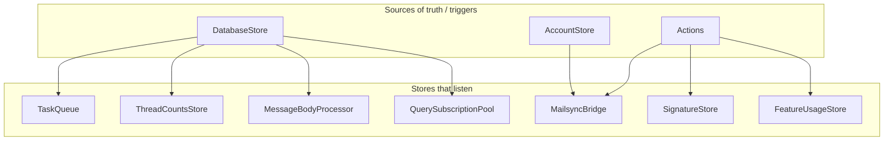
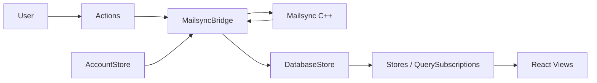

# Module Dependency Maps

This document visualizes relationships between key Flux stores and other core modules: who listens to whom and how state flows. It complements [data-flow.md](data-flow.md), which focuses on the end-to-end data path.

## High-Level Data Dependencies

- **DatabaseStore** is the main source of change notifications: when the sync engine emits deltas, MailsyncBridge calls `DatabaseStore.trigger(record)`, and any store or component that has subscribed via `DatabaseStore.listen(...)` receives the change.
- **Actions** are the main way the UI requests work (e.g. `queueTask`, `closeModal`). Stores that need to react to user actions subscribe to the relevant action.
- **AccountStore** holds the list of accounts; MailsyncBridge listens so it can ensure one sync process per account.

---

## Listen Relationships (Summary Table)

| Listener | Listens to | Purpose |
|----------|------------|---------|
| **MailsyncBridge** | Actions.queueTask, queueTasks, cancelTask, fetchBodies | Forward tasks to sync process; fetch bodies on demand. |
| **MailsyncBridge** | AccountStore | ensureClients: spawn/kill sync process per account. |
| **TaskQueue** | DatabaseStore (implicit via Task model) | Expose queue(), completed(), waitForPerformLocal/Remote. |
| **ThreadCountsStore** | DatabaseStore | Refresh thread counts when Thread/category data changes. |
| **MessageBodyProcessor** | DatabaseStore | Process body content when Message changes. |
| **QuerySubscriptionPool** | DatabaseStore | Invalidate/refresh query subscriptions when relevant models change. |
| **SignatureStore** | Actions (removeSignature, upsertSignature, selectSignature, toggleAccount) | Update signature state from user actions. |
| **FeatureUsageStore** | Actions.closeModal | Track feature usage when modals close. |
| **FolderSyncProgressStore** | self (listen) | Internal debouncing. |
| **UndoRedoStore** | Task completion (via task lifecycle) | Register undo for completed tasks that support undo. |

Many other stores and components subscribe to DatabaseStore or to specific stores (e.g. FocusedContentStore, RecentlyReadStore) without being listed here; the diagram above captures the main dependency directions.

---

## Store → Model Dependencies

Stores typically depend on **models** for the shape of data; they do not “listen” to models directly. Data flows as:

1. **DatabaseStore** receives a change record (from MailsyncBridge).
2. **DatabaseStore.trigger(record)** notifies listeners with `{ objectClass, objects, type }`.
3. Listeners use **objectClass** (e.g. Thread, Message, Task) to decide whether to refresh, and use **objects** (Model instances) to update their state or re-query.

So the dependency is: **Store → DatabaseStore (listen)** and **Store → Model (data shape / queries)**. Key models used across the app include Thread, Message, Account, Folder, Label, Contact, Task, Draft, Event (calendar).

---

## MailsyncBridge as Hub

MailsyncBridge sits between the UI and the sync engine:

- **Inbound**: Listens to **stdout** of MailsyncProcess (via `client.on('deltas', this._onIncomingMessages)`); then calls DatabaseStore.trigger and optionally task onSuccess/onError.
- **Outbound**: Listens to **Actions** (queueTask, etc.) and **AccountStore**; sends JSON to Mailsync process stdin and manages process lifecycle.

So for “who triggers whom”: **Actions + AccountStore → MailsyncBridge → Mailsync process**; **Mailsync process → MailsyncBridge → DatabaseStore → other stores and UI**.

---

## Diagram: Who Triggers Whom

For a step-by-step trace of the critical path, see [data-flow.md](data-flow.md).
